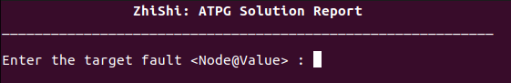
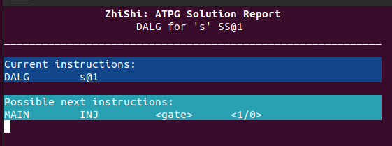
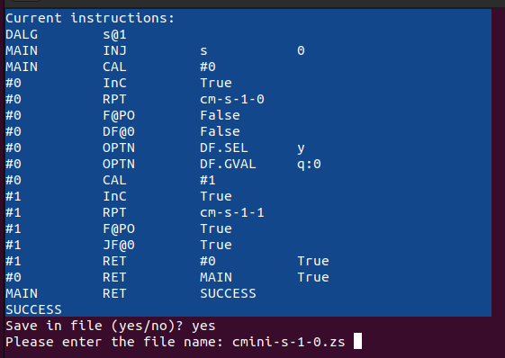

# ZhiShi-IDE
**Interactive Design Environment for ZhiShi ATPG Report Format**

Authors: M. Saeed Abrishami (abri442@usc.edu) and Nikhil Vas (nvas@usc.edu). 

USC EE658 course webpage: https://sportlab.usc.edu/~msabrishami/ee658.html

This Python-based tool is designed to facilitate the creation of .zs (ZhiShi) reports. Simply, the user can report the ATPG solution line by line. After each line is entered by the user, the program analyzes the keywords and based on its basic understanding of the ATPG algorithm, it suggests  the next possible lines. 

The IDE can only suggest the next possible lines based on previous lines keywords, and is not capable of neither evaluating the correctness of the flow nor understanding the netlist graph. 

## Step by Step Instructions
You can simply download the python code run the tool using python3: 
```
$ python3 ZhiShi-IDE-v02.py
```

The program Initially prompts the user to specify a circuit node and its associated fault condition (either stuck-at-0 or stuck-at-1) using a straightforward input format such as node@1 or node@0. 

<div align="center">
    
    <br>
    <em>Opening window of the ZhiShi IDE</em>
</div>

<br>

After the user introduces the target fault, the tool provides two pieces of information: 
- Current instructions: The history of the user's instructions. 
- Possible next instructions: Suggestions for subsequent steps that align with the procedures of the underlying ATPG algorithm. 

<div align="center">
    
    <br>
    <em>After introducing the target fault</em>
</div>
<br>

Upon completing the instructions, the tool inquires whether the user wishes to save the session's output. Affirmative responses ('yes' or 'y') trigger a prompt for a filename, under which the .zs file will be stored.

<div align="center">
    
    <br>
    <em>IDE prompts users for storing the report after it has reached a SUCCESS or FAILURE.</em>
</div>
<br>

In conclusion, the tool's guiding mechanism is aimed at simplifying the documentation process, ensuring users can accurately and methodically log each step of the algorithm. 


## Examples
We had provided the .zs reports of all five solutions for line s-SS@1 fault in cmini netlist. 
